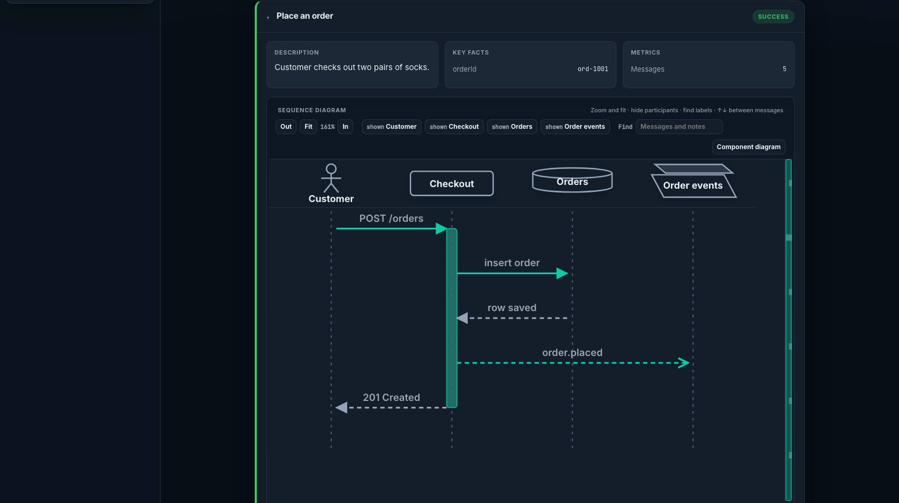
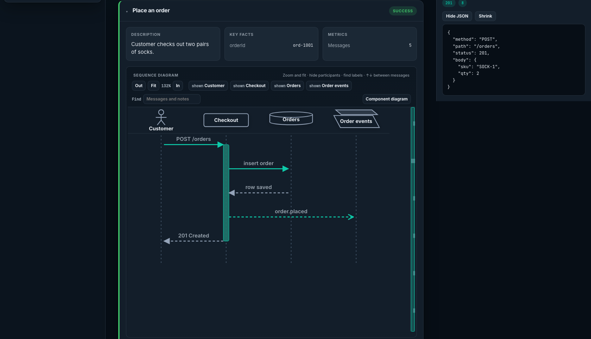
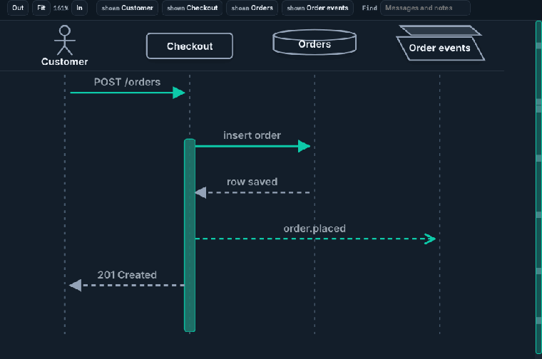

# LSD Mono

LSD Mono records a scenario as a sequence of messages and writes an interactive HTML report. `lsd-mono-core` is the capture API and the report UI. `lsd-mono-junit-jupiter` completes a scenario for each JUnit Jupiter 6 test.

Origin is https://github.com/lsd-consulting/lsd-mono.git. Do not push unless that is decided.

## Depend on it

From another project in this build:

```kotlin
dependencies {
    implementation(project(":modules:lsd-mono-core"))
    testImplementation(project(":modules:lsd-mono-junit-jupiter"))
    testImplementation(project(":modules:lsd-mono-cucumber-8"))
}
```

The artifacts are `io.lsdconsulting:lsd-mono-core`, `io.lsdconsulting:lsd-mono-junit-jupiter`, and `io.lsdconsulting:lsd-mono-cucumber-8`, version `0.0.1-SNAPSHOT`. They are not published. JDK 21. Cucumber support is major 8.

## Capture a scenario

```kotlin
import io.lsdconsulting.lsd.mono.core.LsdContext
import io.lsdconsulting.lsd.mono.core.capture.messages
import io.lsdconsulting.lsd.mono.core.capture.withData
import io.lsdconsulting.lsd.mono.core.capture.withLabel
import io.lsdconsulting.lsd.mono.core.capture.withType
import io.lsdconsulting.lsd.mono.core.domain.MessageType
import io.lsdconsulting.lsd.mono.core.domain.ParticipantType.ACTOR
import io.lsdconsulting.lsd.mono.core.domain.ParticipantType.DATABASE
import io.lsdconsulting.lsd.mono.core.domain.ParticipantType.PARTICIPANT
import io.lsdconsulting.lsd.mono.core.domain.ParticipantType.QUEUE

val lsd = LsdContext()
lsd.addParticipants(
    ACTOR.called("Customer"),
    PARTICIPANT.called("Checkout"),
    DATABASE.called("Orders"),
    QUEUE.called("Order events"),
)
lsd.addFact("orderId", "ord-1001")
lsd.capture(
    "Customer" messages "Checkout" withLabel "POST /orders" withData mapOf(
        "method" to "POST",
        "path" to "/orders",
        "status" to 201,
        "body" to mapOf("sku" to "SOCK-1", "qty" to 2),
    ),
)
lsd.activate("Checkout")
lsd.capture("Checkout" messages "Orders" withLabel "insert order")
lsd.response("Orders", "Checkout", "row saved")
lsd.capture(
    "Checkout" messages "Order events" withLabel "order.placed" withType MessageType.ASYNCHRONOUS withData mapOf(
        "orderId" to "ord-1001",
        "sku" to "SOCK-1",
    ),
)
lsd.response("Checkout", "Customer", "201 Created")
lsd.deactivate("Checkout")
lsd.completeScenario("Place an order", "Customer checks out two pairs of socks.")
val listing = lsd.completeReport("Place an order")
lsd.createIndex()
```

`completeReport` writes under `build/reports/lsd` (set `lsd.mono.report.outputDir` to move it). Open `Place-an-order-diagram.html`. That file is the report. `Place-an-order-report.html` is only a short listing, and `createIndex()` adds `index.html` when you have written more than one.

Click an arrow to open its JSON. `method`, `path`, and `status` stay on the arrow. Any other fields load from `Place-an-order-payloads.js` when the panel opens.

The participant type is the header shape. `ACTOR` is a person, `DATABASE` a cylinder, `QUEUE` stacked plates. `ENTITY` is a circle and `BOUNDARY` a circle with a bar. Anything else, including `PARTICIPANT`, is a rounded box. Sync responses and async messages draw an arrow head at the destination.

## From a JUnit test

`LsdExtension` completes the scenario after each test and writes the report after the class. Capture inside the test. Do not call `completeScenario` or `completeReport` yourself.

```kotlin
import io.lsdconsulting.lsd.mono.core.LsdContext
import io.lsdconsulting.lsd.mono.core.capture.messages
import io.lsdconsulting.lsd.mono.core.capture.withLabel
import io.lsdconsulting.lsd.mono.junitjupiter.LsdExtension
import org.junit.jupiter.api.Test
import org.junit.jupiter.api.extension.ExtendWith

@ExtendWith(LsdExtension::class)
class PlaceOrderTest {
    private val lsd = LsdContext.instance

    @Test
    fun `places an order`() {
        lsd.addFact("orderId", "ord-1001")
        lsd.capture("Customer" messages "Checkout" withLabel "POST /orders")
    }
}
```

Open `build/reports/lsd/PlaceOrderTest-diagram.html`. Use the same `addParticipants` and `capture` calls as the scenario above when you want the shapes.

## From a Cucumber scenario

`LsdCucumberPlugin` (`io.lsdconsulting.lsd.mono.cucumber.LsdCucumberPlugin`) completes the scenario after each Cucumber scenario and writes the report after the feature. Capture inside the step definitions. Do not call `completeScenario` or `completeReport` yourself.

Register it in `src/test/resources/junit-platform.properties`:

```properties
cucumber.plugin=io.lsdconsulting.lsd.mono.cucumber.LsdCucumberPlugin
cucumber.glue=com.example.steps
```

Use Cucumber 8 (`cucumber-java8` and `cucumber-junit-platform-engine`). A feature file named `place_order.feature` is written to `build/reports/lsd/place_order-diagram.html`. The module README has the step definitions for the diagram below.

## What the report looks like

The diagram for the scenario above. Customer, Orders, and Order events use their types. The response and the async publish show the direction.



Clicking `POST /orders` opens the payload.



Zoom until the diagram scrolls.



Regenerate those three files from the current UI:

```bash
./gradlew :modules:lsd-mono-core:readmeSamples
```

The task captures the scenario with `LsdContext`, then screenshots the packaged shell with headless Chromium. It uses Node 22 from nvm when that is installed, and it does not change the default Node alias. It is not part of `build` or `check`.

## Build

```bash
./gradlew build
```

JDK 21. `:modules:lsd-mono-core:build` runs the Vite shell build (`npm ci`, then `npm run build:single`) and vitest is on `check`. Those tasks also prepend Node 22 and leave the default alias alone.

```
modules/lsd-mono-core/            lsd-mono-core, report UI in report/
modules/lsd-mono-junit-jupiter/   JUnit Jupiter 6 extension
modules/lsd-mono-cucumber-8/      Cucumber 8 plugin
build-logic/                      convention plugins (lsd.kotlin-jvm)
```

Legacy behaviour for comparison is upstream at [lsd-core](https://github.com/lsd-consulting/lsd-core). It is not in this tree.
