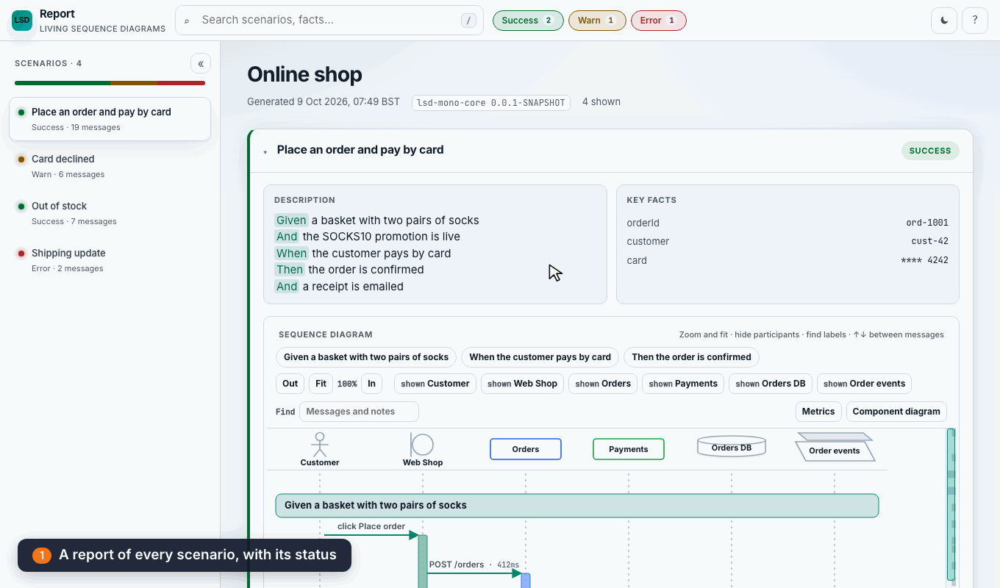

# LSD Mono

LSD Mono records a scenario as a sequence of messages and writes an interactive HTML report. [`lsd-mono-core`](modules/lsd-mono-core) is the capture API and the report UI.



[`lsd-mono-cucumber-8` README](modules/lsd-mono-cucumber-8/README.md) covers the Cucumber 8 plugin.

[`lsd-mono-junit-jupiter` README](modules/lsd-mono-junit-jupiter/README.md) covers the JUnit Jupiter 6 extension that completes a scenario for each test.

Origin is https://github.com/lsd-consulting/lsd-mono.git. `main` has been pushed there.

## Depend on it

From another project in this build:

```kotlin
dependencies {
    implementation(project(":modules:lsd-mono-core"))
    testImplementation(project(":modules:lsd-mono-junit-jupiter"))
    testImplementation(project(":modules:lsd-mono-cucumber-8"))
}
```

The artifacts are `io.lsdconsulting:lsd-mono-core`, `io.lsdconsulting:lsd-mono-junit-jupiter`, and `io.lsdconsulting:lsd-mono-cucumber-8`, version `0.0.1-SNAPSHOT`. They are not published. JDK 21. Cucumber support is major 8.

## Capture a scenario

```kotlin
import io.lsdconsulting.lsd.mono.core.LsdContext
import io.lsdconsulting.lsd.mono.core.capture.messages
import io.lsdconsulting.lsd.mono.core.capture.withData
import io.lsdconsulting.lsd.mono.core.capture.withLabel
import io.lsdconsulting.lsd.mono.core.capture.withType
import io.lsdconsulting.lsd.mono.core.domain.MessageType
import io.lsdconsulting.lsd.mono.core.domain.ParticipantType.ACTOR
import io.lsdconsulting.lsd.mono.core.domain.ParticipantType.DATABASE
import io.lsdconsulting.lsd.mono.core.domain.ParticipantType.PARTICIPANT
import io.lsdconsulting.lsd.mono.core.domain.ParticipantType.QUEUE

val lsd = LsdContext()
lsd.addParticipants(
    ACTOR.called("Customer"),
    PARTICIPANT.called("Checkout"),
    DATABASE.called("Orders"),
    QUEUE.called("Order events"),
)
lsd.addFact("orderId", "ord-1001")
lsd.capture(
    "Customer" messages "Checkout" withLabel "POST /orders" withData mapOf(
        "method" to "POST",
        "path" to "/orders",
        "status" to 201,
        "body" to mapOf("sku" to "SOCK-1", "qty" to 2),
    ),
)
lsd.activate("Checkout")
lsd.capture("Checkout" messages "Orders" withLabel "insert order")
lsd.response("Orders", "Checkout", "row saved")
lsd.capture(
    "Checkout" messages "Order events" withLabel "order.placed" withType MessageType.ASYNCHRONOUS withData mapOf(
        "orderId" to "ord-1001",
        "sku" to "SOCK-1",
    ),
)
lsd.response("Checkout", "Customer", "201 Created")
lsd.deactivate("Checkout")
lsd.completeScenario("Place an order", "Customer checks out two pairs of socks.")
val listing = lsd.completeReport("Place an order")
lsd.createIndex()
```

`completeReport` writes under `build/reports/lsd` (set `lsd.mono.report.outputDir` to move it). Open `Place-an-order-1153f62c-diagram.html`. That file is the report. `Place-an-order-1153f62c-report.html` is only a short listing, and its path is what `completeReport` returns. The 8 characters are a hash of the title, so two titles that read the same as file names (`Place an order`, `Place-an-order`) never overwrite each other. `createIndex()` writes `index.html`, which lists every report in the directory, including ones written by other test JVMs or modules.

Click an arrow to open its JSON. `method`, `path`, and `status` stay on the arrow. Any other fields load from `Place-an-order-1153f62c-payloads.js` when the panel opens.

The participant type is the header shape. `ACTOR` is a person, `DATABASE` a cylinder, `QUEUE` stacked plates. `ENTITY` is a circle and `BOUNDARY` a circle with a bar. Anything else, including `PARTICIPANT`, is a rounded box. Sync responses and async messages draw an arrow head at the destination.

## From a JUnit test

See the [JUnit Jupiter module README](modules/lsd-mono-junit-jupiter/README.md) for the extension setup and capture example. It completes each test scenario and writes the report after the class.

## From a Cucumber scenario

See the [Cucumber 8 module README](modules/lsd-mono-cucumber-8/README.md) for plugin registration, step definitions, and the capture example. It completes each scenario and writes one report per feature when the run finishes.

## Parallel tests

Capture is thread-safe, and both integrations support parallel runs (JUnit's `junit.jupiter.execution.parallel.enabled`, Cucumber's `cucumber.execution.parallel.enabled`). Each test or scenario gets its own buffer, bound to the thread that runs it, so `LsdContext.instance.capture` in a test lands in that test. Each test class or feature gets its own report.

A thread that is not bound to a test, such as an HTTP server thread, captures into the running test when only one test is running. When several are running, LSD cannot tell which test the capture belongs to: it logs a warning and keeps the capture out of all of them. Carry the test onto threads you start with `LsdContext.instance.wrap(task)` or `lsd.currentScenario()?.bind()`.

## What the report looks like

The tour at the top clicks around a small shop report: four scenarios with every status, six participants, payloads, and durations. [`FeatureTourSample.kt`](modules/lsd-mono-core/src/readme/kotlin/io/lsdconsulting/lsd/mono/core/readme/FeatureTourSample.kt) captures it. The [lsd-mono-core README](modules/lsd-mono-core/README.md#component-diagram) covers the **Component diagram** button.

Regenerate the tour, and the component diagram clip, from the current UI:

```bash
./gradlew :modules:lsd-mono-core:readmeSamples
```

The task captures the tour report with `LsdContext`, then drives the packaged shell with headless Chromium and encodes `docs/readme/feature-tour.gif`. It uses Node 22 from nvm when that is installed, and it does not change the default Node alias. It is not part of `build` or `check`.

### Kitchen-sink sample

The [kitchen-sink report](https://lsd-consulting.github.io/lsd-mono/kitchen-sink.html) is one report that uses every diagram feature, so layout problems are easy to spot. It follows an online shop order across 14 lifelines in four scenarios: happy path, payment declined, out of stock, and async fulfilment. It covers every participant shape, every arrow type, short arrows to and from the edge, self-calls, nested and overlapping activations, notes, sections, delays, spacers, payloads, timestamps, and failed and errored scenarios. [`KitchenSinkSample.kt`](modules/lsd-mono-core/src/readme/kotlin/io/lsdconsulting/lsd/mono/core/readme/KitchenSinkSample.kt) captures it. The report is not committed. The [Pages workflow](.github/workflows/pages.yml) builds it from the current UI on every push to `main` that touches `lsd-mono-core`, the build, or `docs/samples`, and publishes it with [`docs/samples/index.html`](docs/samples/index.html). To build the site locally, then open `modules/lsd-mono-core/build/pages/kitchen-sink.html` in a browser:

```bash
./gradlew :modules:lsd-mono-core:kitchenSinkSample
```

[Generated files](docs/generated-files.md) lists every generated file, which ones are committed, and how CI keeps them fresh. [CI](docs/ci.md) describes the workflows.

## Build

```bash
./gradlew build
```

JDK 21. `:modules:lsd-mono-core:build` runs the Vite shell build (`npm ci`, then `npm run build:single`) and vitest is on `check`. Those tasks also prepend Node 22 and leave the default alias alone.

`check` also lints and measures coverage: ktlint for the Kotlin (`./gradlew spotlessApply` fixes formatting), Kover line-coverage floors per module, and for the report UI a type-check of the code and its tests, ESLint, Prettier and Vitest coverage thresholds. See [lint, format and coverage](docs/ci.md#lint-format-and-coverage).

```
modules/lsd-mono-core/            lsd-mono-core, report UI in report/
modules/lsd-mono-junit-jupiter/   JUnit Jupiter 6 extension
modules/lsd-mono-cucumber-8/      Cucumber 8 plugin
build-logic/                      convention plugins (lsd.kotlin-jvm)
```

Legacy behaviour for comparison is upstream at [lsd-core](https://github.com/lsd-consulting/lsd-core). It is not in this tree.
