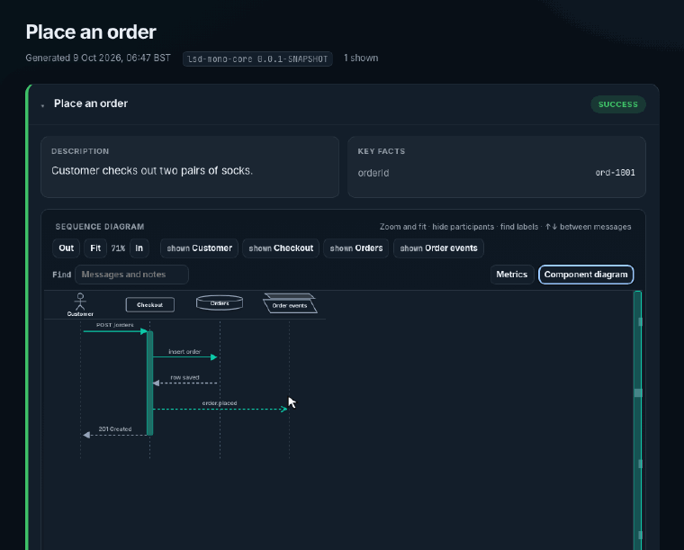

# lsd-mono-core

First-party **LSD Mono** core library. This is the greenfield product path:
report UI in `report/` (Vite + TypeScript + custom SVG), plus a
thin Kotlin/JVM capture and report façade so integrations (e.g.
`lsd-mono-junit-jupiter`) can migrate off published Maven `lsd-core`.

## What this is / is not

| | |
|--|--|
| **Is** | Mono-owned artifact `lsd-mono-core`, package `io.lsdconsulting.lsd.mono.core` |
| **Is** | Report UI in `report/` (`modules/lsd-mono-core/report`) |
| **Is not** | A vendor of legacy Maven `io.github.lsd-consulting:lsd-core` sources |
| **Legacy reference** | Upstream [lsd-core](https://github.com/lsd-consulting/lsd-core) for API / behaviour comparison |

## Layout

```
lsd-mono-core/
├── report/                 # Vite+TS report UI (dev with npm)
│   ├── src/                     # UI, custom SVG diagram, sample data
│   ├── lsd-report.single.html
│   └── README.md
├── src/main/kotlin/…/mono/core/ # Kotlin façade (capture + write reports)
├── src/main/resources/lsd-mono-core/report/
│   └── lsd-report-payloads.js        # sample payloads for the shell's built-in demo
└── build.gradle.kts                 # reportSingle + reportTest
```

## What runs today (`./gradlew build`)

**Works now**

- Kotlin library compiles and tests
- `LsdContext` façade: facts, `completeScenario`, `completeReport`, `createIndex`,
  `clear`, id generation, HTML escape, popup helper
- Report writer emits, per report, files named `<title>-<hash>` (`ReportWriter.reportFileStem`;
  the hash is of the report key, or of the title). `ReportWriter.writeReport(report, dir)` hashes the
  title; `writeReport(report, dir, reportKey = key)` hashes the key:
  - `*-diagram.html` — the classpath `lsd-report.single.html` shell with the captured
    `ReportJson` injected (the shell falls back to sample data when opened without one)
  - `*-payloads.js` — message bodies, loaded when the inspector opens
  - `*-report.json` — ReportJson-shaped payload (aligned with `report/src/types.ts`)
  - `*-report.html` — minimal mono HTML listing scenarios (status, description, facts)
  - `index.html` from `createIndex`, listing every report in the directory
  - Files are written to a temporary file and moved into place. There are no shared
    "latest" files, so test classes, forks and modules can share one directory.
- Report page: a **Component diagram** button per scenario draws the components and their calls in the inspector, in the browser, from that scenario's messages

**Deferred / optional**

- PlantUML / Handlebars compatibility — intentionally out of the Mono product path; see upstream [lsd-core](https://github.com/lsd-consulting/lsd-core) for legacy reference

## Component diagram

Each scenario's diagram toolbar has a **Component diagram** button. Clicking it draws that scenario's components and the calls between them in the side panel. The report builds the diagram in the browser from the messages it already has, so there is nothing to switch on in the build and no extra file.



- Every participant on a sync, async, bi-directional, or lost message is a component, drawn with its participant type (actor, database, queue, and so on). Responses and short arrows add no edges.
- Links carry no captions, so a busy pair of components stays readable. Sync links are solid and async links are dashed, and the head shows the direction. Repeated calls between the same two components share one link with a small count badge.
- Hover over a link to see its messages in its tooltip, for example `Orders to Orders DB, 3 interactions:` then `load basket · sync` on the next line. Click a link, or focus it and press Enter, to list them under the drawing.
- Callers sit above the components they call. Escape or Close puts focus back on the button.

`./gradlew :modules:lsd-mono-core:readmeSamples` regenerates the GIF with the other README samples.

## Kotlin API (migration-oriented)

Inspired by legacy entry points (`LsdContext`, `Status`, properties, popup links)
but under the **mono** package:

```kotlin
import io.lsdconsulting.lsd.mono.core.LsdContext
import io.lsdconsulting.lsd.mono.core.domain.Status

val lsd = LsdContext.instance
lsd.addFact("framework", "junit-jupiter-6")
lsd.completeScenario("my scenario", "<p>ok</p>", Status.SUCCESS)
lsd.completeReport("My Suite")
lsd.createIndex()
```

Property keys use the `lsd.mono.*` prefix (with fallbacks to legacy `lsd.core.*`
and `lsd.junit.*` names where useful for migration).

### Threads and parallel tests

Every `LsdContext` method is thread-safe. Unscoped calls (`capture`, `message`,
`addFact`, `completeScenario`) go to:

1. the scenario the calling thread is bound to, if any;
2. otherwise the only running scenario, if exactly one is running;
3. otherwise the default scenario, which is how single-threaded code has always
   worked. With several scenarios running, a warning is logged once.

Test integrations start a scenario per test and group them by report key:

```kotlin
val scenario = lsd.beginScenario(reportKey = "com.example.OrderTest") // binds this thread
lsd.message("Client", "Api", "POST /orders")                          // lands in `scenario`
executor.submit(lsd.wrap { lsd.message("Api", "Db", "INSERT") })       // so does this
scenario.complete("places an order")
lsd.completeReport("OrderTest", reportKey = "com.example.OrderTest")
```

`LsdScenario` also has `capture`, `addFact`, `bind()` (an `AutoCloseable`) and
`wrapCallable`. A capture into a scenario that has already completed is dropped
with a warning rather than being given to the next one.

## Report UI (manual)

```bash
cd modules/lsd-mono-core/report
npm ci
npm test             # vitest — layout, diagram view (zoom/fit/columns/search), SVG cues
npm run dev          # http://localhost:5173/
# or open report/lsd-report.single.html in Chrome (file://)
```

`./gradlew :modules:lsd-mono-core:build` runs `reportSingle` (`npm ci` and `npm run build:single`) and `reportTest` (`npm test`). The shell is packaged from `build/generated/resources`, not written back into `src/main/resources`. Needs Node 22.6 or later (`engines` in `report/package.json`). The Gradle tasks prepend nvm Node 22 when it is installed (`build-logic` `NodeToolchain.kt`) and do not change your default Node.

See `report/README.md` for how to run the report UI.
