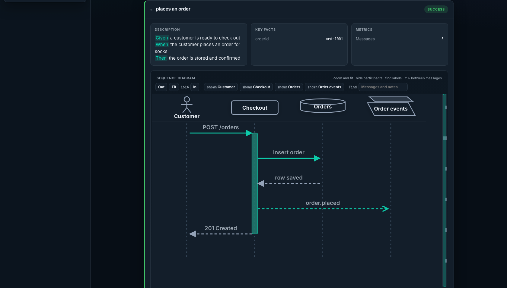
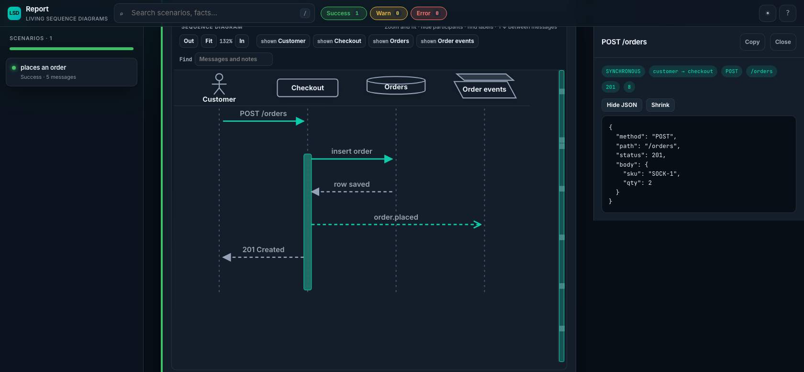
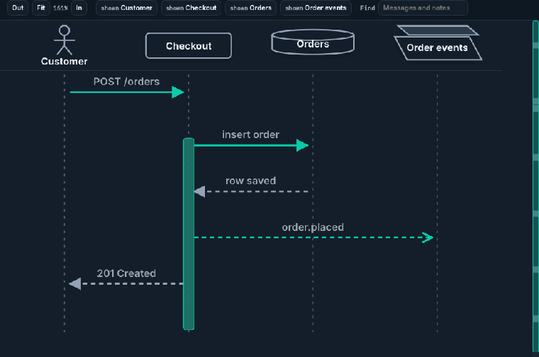

# lsd-mono-cucumber-8

`lsd-mono-cucumber-8` is the Cucumber 8 plugin for [lsd-mono-core](../lsd-mono-core) that turns each scenario into a living sequence diagram. You still capture the interactions yourself with `LsdContext` inside your steps. The plugin records pass, fail, or warning when the scenario ends, and writes the report when the feature finishes. It depends on first-party `lsd-mono-core`, not the old published `lsd-core`, and there is no PlantUML on this path. It is pinned to Cucumber 8 (`strictly [8,9)`). The catalog requests `8.0.4`.

## Depend on it

From another project in this repo:

```kotlin
dependencies {
    testImplementation(project(":modules:lsd-mono-cucumber-8"))
    testImplementation("io.cucumber:cucumber-java8:8.0.4")
    testImplementation("io.cucumber:cucumber-junit-platform-engine:8.0.4")
}
```

`lsd-mono-cucumber-8` brings in `lsd-mono-core` and `io.cucumber:cucumber-plugin`. You still need a Cucumber 8 runtime and a step-definition library. `cucumber-java8` and `cucumber-junit-platform-engine` are the pair this module is tested with. Stay on Cucumber 8. This build rejects 7.x and 9+.

## Register the plugin

`src/test/resources/junit-platform.properties`:

```properties
cucumber.plugin=io.lsdconsulting.lsd.mono.cucumber.LsdCucumberPlugin
cucumber.glue=com.example.steps
cucumber.publish.enabled=false
```

The class is `io.lsdconsulting.lsd.mono.cucumber.LsdCucumberPlugin`. It implements Cucumber's `ConcurrentEventListener`.

## Capture from a step

Do **not** call `completeScenario` or `completeReport` yourself. The plugin does that when the scenario and the feature finish.

```kotlin
import io.cucumber.java8.En
import io.lsdconsulting.lsd.mono.core.LsdContext
import io.lsdconsulting.lsd.mono.core.capture.messages
import io.lsdconsulting.lsd.mono.core.capture.withData
import io.lsdconsulting.lsd.mono.core.capture.withLabel
import io.lsdconsulting.lsd.mono.core.capture.withType
import io.lsdconsulting.lsd.mono.core.domain.MessageType
import io.lsdconsulting.lsd.mono.core.domain.ParticipantType.ACTOR
import io.lsdconsulting.lsd.mono.core.domain.ParticipantType.DATABASE
import io.lsdconsulting.lsd.mono.core.domain.ParticipantType.PARTICIPANT
import io.lsdconsulting.lsd.mono.core.domain.ParticipantType.QUEUE

class PlaceOrderSteps : En {
    init {
        val lsd = LsdContext.instance

        Given("a customer is ready to check out") {
            lsd.addParticipants(
                ACTOR.called("Customer"),
                PARTICIPANT.called("Checkout"),
                DATABASE.called("Orders"),
                QUEUE.called("Order events"),
            )
            lsd.addFact("orderId", "ord-1001")
        }

        When("the customer places an order for socks") {
            lsd.capture(
                "Customer" messages "Checkout" withLabel "POST /orders" withData mapOf(
                    "method" to "POST",
                    "path" to "/orders",
                    "status" to 201,
                    "body" to mapOf("sku" to "SOCK-1", "qty" to 2),
                ),
            )
            lsd.activate("Checkout")
            lsd.capture("Checkout" messages "Orders" withLabel "insert order")
            lsd.response("Orders", "Checkout", "row saved")
            lsd.capture(
                "Checkout" messages "Order events" withLabel "order.placed"
                    withType MessageType.ASYNCHRONOUS withData mapOf(
                        "orderId" to "ord-1001",
                        "sku" to "SOCK-1",
                    ),
            )
        }

        Then("the order is stored and confirmed") {
            lsd.response("Checkout", "Customer", "201 Created")
            lsd.deactivate("Checkout")
        }
    }
}
```

```gherkin
Feature: Place an order

  Scenario: places an order
    Given a customer is ready to check out
    When the customer places an order for socks
    Then the order is stored and confirmed
```

A passed scenario is stored as a success. The scenario title is the Cucumber scenario name (`places an order`). A scenario outline example is suffixed ` #1`, ` #2`, and so on. The description is the step lines as plain text. A failed scenario is stored with status error and a structured error (headline, message, stack). Anything that is not passed and not failed (skipped, pending, undefined) is a warning.

Set `lsd.mono.cucumber.splitBySteps=true` to insert a section at each step. That stays in the same diagram. It is not a new page.

## Where the report is written

After the feature finishes, open:

```text
build/reports/lsd/place_order-diagram.html
```

The file name comes from the feature file (`place_order.feature`), not from the `Feature:` title. That file is the report. `place_order-report.html` is only a short listing. `createIndex()` adds `index.html` when more than one report exists.

Override the directory with `lsd.mono.report.outputDir` (the legacy `lsd.core.report.outputDir` key is still honoured).

Click an arrow to open its JSON. `method`, `path`, and `status` stay on the arrow. Other fields load from the companion payloads file when the panel opens. Participant types set the header shape: `ACTOR`, `DATABASE`, `QUEUE`, and so on.

## What the report looks like

The diagram for the scenario above after a successful feature.



Clicking `POST /orders` opens the payload.



Zoom until the diagram scrolls.



Regenerate those three files from the current UI:

```bash
./gradlew :modules:lsd-mono-cucumber-8:readmeSamples
```

The task runs the feature through `LsdCucumberPlugin`, then screenshots the packaged shell with headless Chromium via the core report's `readme-samples.mjs`. It uses Node 22 from nvm when that is installed, and it does not change the default Node alias. It is not part of `build` or `check`.

## Build

```bash
./gradlew :modules:lsd-mono-cucumber-8:build
```

JDK 21. See the [root README](../../README.md) for the core capture API and the shared report UI.
