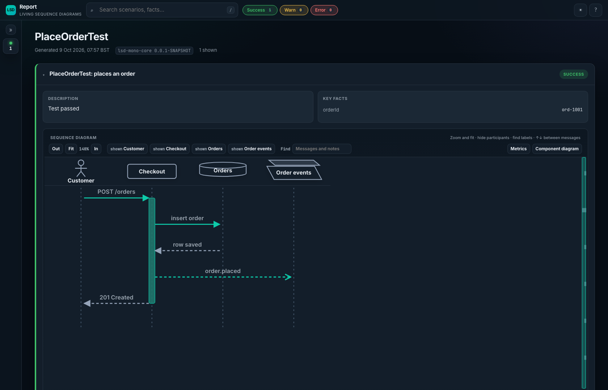
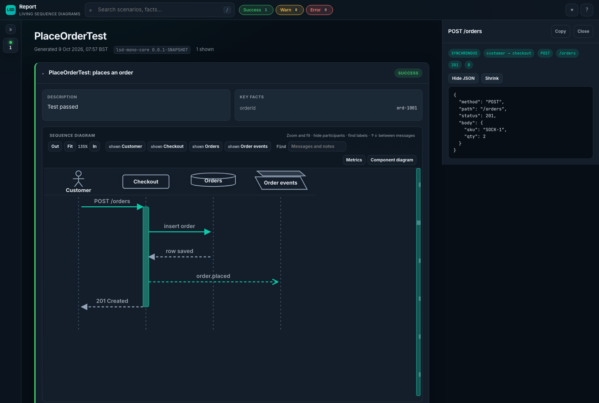
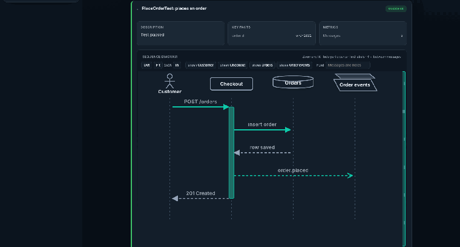

# lsd-mono-junit-jupiter

`lsd-mono-junit-jupiter` is the JUnit Jupiter 6 extension for [lsd-mono-core](../lsd-mono-core) that turns each test into a living sequence diagram. You still capture the interactions yourself with `LsdContext` inside the test. When the test ends, the extension stores a passed test as a successful scenario, and a failure or abort with a structured error. It writes the report when the class finishes. It depends on first-party `lsd-mono-core`, not the old published `lsd-core`, and there is no PlantUML on this path.

This module replaces the older published `lsd-junit5` / `lsd-junit-jupiter` stack for greenfield Mono work.

## Depend on it

From another project in this repo:

```kotlin
testImplementation(project(":modules:lsd-mono-junit-jupiter"))
```

That pulls in `lsd-mono-core` and the Jupiter API. You still need a Jupiter engine on the test runtime classpath (the `junit-jupiter` bundle is enough).

## Capture from a test

Register `LsdExtension`. Capture inside the test. Do **not** call `completeScenario` or `completeReport` yourself — the extension does that after each test and after the class.

```kotlin
import io.lsdconsulting.lsd.mono.core.LsdContext
import io.lsdconsulting.lsd.mono.core.capture.messages
import io.lsdconsulting.lsd.mono.core.capture.withData
import io.lsdconsulting.lsd.mono.core.capture.withLabel
import io.lsdconsulting.lsd.mono.core.capture.withType
import io.lsdconsulting.lsd.mono.core.domain.MessageType
import io.lsdconsulting.lsd.mono.core.domain.ParticipantType.ACTOR
import io.lsdconsulting.lsd.mono.core.domain.ParticipantType.DATABASE
import io.lsdconsulting.lsd.mono.core.domain.ParticipantType.PARTICIPANT
import io.lsdconsulting.lsd.mono.core.domain.ParticipantType.QUEUE
import io.lsdconsulting.lsd.mono.junitjupiter.LsdExtension
import io.lsdconsulting.lsd.mono.junitjupiter.LsdPostTestProcessing
import org.junit.jupiter.api.Test
import org.junit.jupiter.api.extension.ExtendWith

@ExtendWith(LsdExtension::class)
class PlaceOrderTest {
    private val lsd = LsdContext.instance

    @Test
    fun `places an order`() {
        lsd.addParticipants(
            ACTOR.called("Customer"),
            PARTICIPANT.called("Checkout"),
            DATABASE.called("Orders"),
            QUEUE.called("Order events"),
        )
        lsd.addFact("orderId", "ord-1001")
        lsd.capture(
            "Customer" messages "Checkout" withLabel "POST /orders" withData mapOf(
                "method" to "POST",
                "path" to "/orders",
                "status" to 201,
                "body" to mapOf("sku" to "SOCK-1", "qty" to 2),
            ),
        )
        lsd.activate("Checkout")
        lsd.capture("Checkout" messages "Orders" withLabel "insert order")
        lsd.response("Orders", "Checkout", "row saved")
        lsd.capture(
            "Checkout" messages "Order events" withLabel "order.placed"
                withType MessageType.ASYNCHRONOUS withData mapOf(
                    "orderId" to "ord-1001",
                    "sku" to "SOCK-1",
                ),
        )
        lsd.response("Checkout", "Customer", "201 Created")
        lsd.deactivate("Checkout")
    }

    @LsdPostTestProcessing
    fun captureAfterAsserts() {
        // Optional. Runs after the test body, before the scenario is completed.
        // Useful for a last fact or arrow once assertions have finished.
    }
}
```

A passed test is stored as a successful scenario titled from the class and method display names (for example `PlaceOrderTest: places an order`). A failure or abort is stored with a structured error on the scenario. Nested test classes do not write a second report from the nested `afterAll`.

## Where the report is written

After the class finishes, open:

```text
build/reports/lsd/PlaceOrderTest-diagram.html
```

That file is the report. `PlaceOrderTest-report.html` is only a short listing. `createIndex()` (called by the extension) adds `index.html` when more than one report exists.

Override the directory with `lsd.mono.report.outputDir` (the legacy `lsd.core.report.outputDir` key is still honoured). In this module's own tests that is `build/reports/lsd-test`.

Click an arrow to open its JSON. `method`, `path`, and `status` stay on the arrow. Other fields load from the companion payloads file when the panel opens. Participant types set the header shape: `ACTOR`, `DATABASE`, `QUEUE`, and so on.

The combined component graph is written only when `lsd.mono.components.enabled=true`.

## What the report looks like

The diagram for the scenario above after a successful test.



Clicking `POST /orders` opens the payload.



Zoom until the diagram scrolls.



Regenerate those three files from the current UI:

```bash
./gradlew :modules:lsd-mono-junit-jupiter:readmeSamples
```

The task captures the same scenario the README shows (with the titles `LsdExtension` would use), then screenshots the packaged shell with headless Chromium via the core report's `readme-samples.mjs`. It uses Node 22 from nvm when that is installed, and it does not change the default Node alias. It is not part of `build` or `check`.

## Build

```bash
./gradlew :modules:lsd-mono-junit-jupiter:build
```

JDK 21. See the [root README](../../README.md) for the core capture API and the shared report UI.
